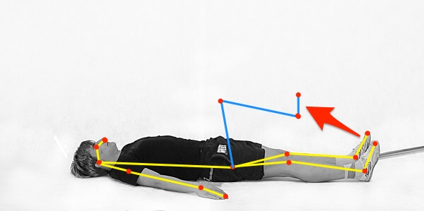
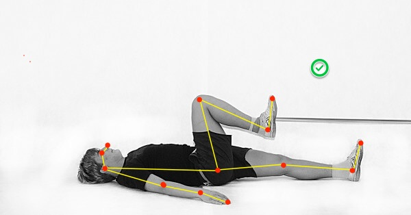

# Post-traumatic recovery AI assistant
#AndroidDevChallenge
## Tell us what your idea is.

In most cases after serious physical traumas, after fractures or ligament ruptures patients need to pass post trauma rehabilitation exercises for post-traumatic recovery. A common practice in this scenario is making physical exercises for improvement and recovery muscles and ligament. 

The main problem here is that fact that such a recovery program usually is not that cheap. Such a price issue is even worse in low-income countries or countries with low health levels. And in case if someone doesn’t have enough budget for his recovery program there is one more problem in this way. Even a simple exercise as squats can be performed incorrectly: tear off the heels from the ground, bend your back. And for more difficult exercise with some of the sports equipment, an additional health problem could appear in case of incorrectly performing.

For resolving these cases our team is going to make post-traumatic rehabilitation exercises more affordable for people who don’t have the ability to pay for their rehabilitation courses in a real clinic. As part of this initiative, our team decided to combine the availability of Android devices and modern machine learning and machine vision technologies, to create a system that can significantly help people who can’t afford to pay for a post-traumatic rehabilitation course to finish their recovery. The final Android application will use a device built-in camera for tracking fitness activity and then displaying the progress on a screen in comparing with the proper way how exercises must be done.

## Tell us how you plan on bringing it to life. 

The idea is to use TensorFlow for making image size invariant model, which will be able to recognize user movements during the exercise and compare it with correct patterns. Output model should consist of several sublayers. First one, based on the PoseNet library will be used for the pose estimation of the user. All other layers going to use mostly for recognition how far or close the user’s body pose from proper pose for specific exercise based on that pose estimation info. At the final stage, we are going to use TensorFlow Converter for making TensorFlow Lite file which will be built-in into the Android app. In this case, Android application could use the device built-in camera, for tracking of post-traumatic exercises and displaying results on the device screen. In addition, on the same device screen, in real-time the user can see how to perform the physiotherapeutic exercise correctly. Last, but not least, is that fact that this application can work offline, shouldn’t worry about connectivity, which could also save the user's budget. 

One of the existing use cases: knee recovery exercise:

1. An app detects the pose of a patient and instructs him with action. Instructions could be placed on the display of the phone or tablet.

2. When a patient made one of the rep exercises in proper way the app notify him with sound and or counter.

The core functionality of the could be also improved by adding a voice assistant to correct the execution of exercises. Or by adding Chromecast support to displaying exercise results on a TV screen.

## Tell us about you.

In the middle of 2019, we have organized the team whose main purpose is making experiments in the intersection between Machine learning technologies and some of the use cases from real life. We are focusing on making simple software prototypes, which could show people how some of their everyday activities could be improved by using modern Artificial intelligent technologies that people could play with them a bit. The main idea is finding new ways of how Artificial intelligence could help people make their lives better. 

For now, our small team consists only of two people:

[Anton Valiukh](https://ua.linkedin.com/in/valiuh) and [Artem Garkusha](https://nl.linkedin.com/in/artemgarkusha)

But that fact, that we have a vision, that Artificial Intelligence and Machine learning could not just cover some business use cases, but also make the world a better way, give us confidence that we will be grooving in the future by finding new people who will join our team. 
